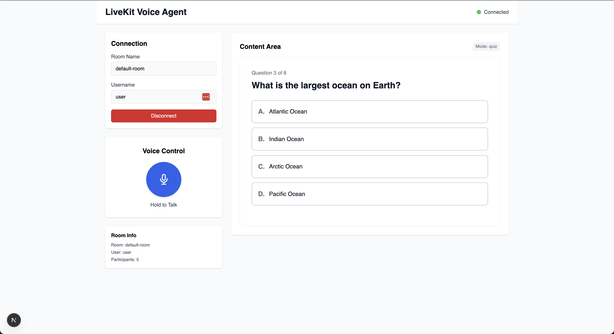
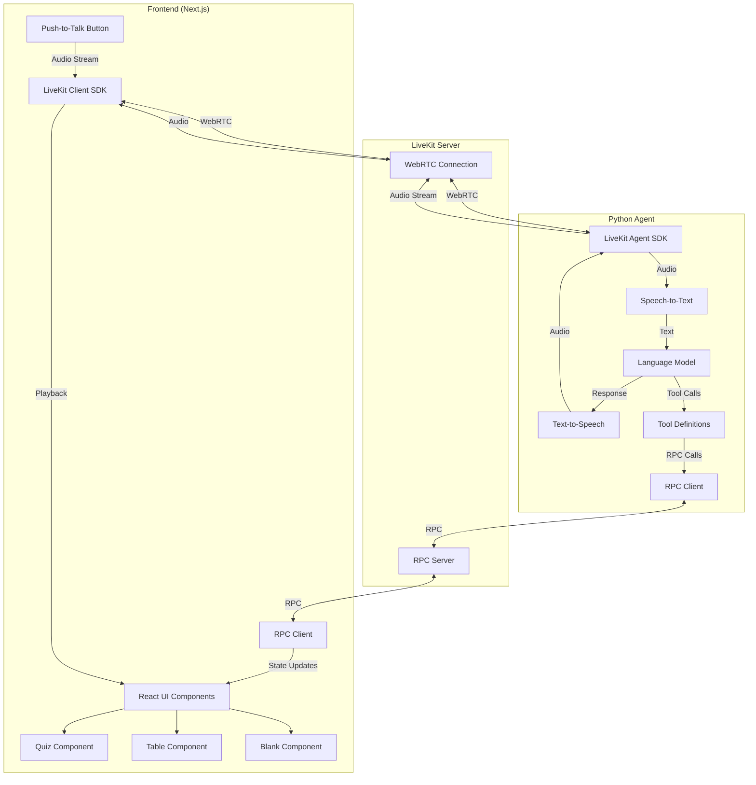

# LiveKit Voice Agent with Visual UI

A React/Next.js web application with a LiveKit voice agent that controls UI components through voice commands. The agent can display quizzes, tables, or blank screens based on user voice input.

## Project Overview

This project demonstrates bidirectional communication between a voice AI agent and a web frontend using LiveKit's RPC (Remote Procedure Calls) mechanism. Users can interact with the agent via push-to-talk and control UI components through natural language commands.

## Features

- 🎤 **Push-to-Talk**: Press and hold button to speak with the agent
- 🎯 **Mode Switching**: Voice commands to switch between Quiz, Table, and Blank modes
- 📝 **Interactive Quiz**: Full quiz functionality with questions, options, and animations
- 🎨 **Visual Feedback**: Animated option selection with correct/incorrect indicators
- 🔄 **State Synchronization**: Quiz state shared between frontend and agent

## Screenshot



## Architecture

The application follows a client-server architecture with real-time bidirectional communication:



### Architecture Components

- **Frontend**: Next.js 14+ with React, TypeScript, Tailwind CSS
- **Agent**: Python agent using LiveKit Agents SDK
- **Communication**: LiveKit WebRTC with RPC methods
- **Server**: Local LiveKit server (Docker) or LiveKit Cloud free tier

## Quick Start

### Prerequisites

- Node.js 18+ and npm/yarn
- Python 3.10+
- Docker (for local LiveKit server) or LiveKit Cloud account
- OpenAI API key (for LLM/STT/TTS) or compatible alternatives

### Setup Instructions

1. **Clone and navigate to project**
   ```bash
   cd rifath_project
   ```

2. **Set up LiveKit Server**
   
   Option A: Local Docker (Recommended for development)
   ```bash
   docker run -p 7880:7880 -p 7881:7881 -p 7882:7882/udp \
     -e LIVEKIT_KEYS="devkey: devsecret" \
     livekit/livekit-server --dev
   ```
   
   Option B: Use LiveKit Cloud (free tier)
   - Sign up at https://cloud.livekit.io
   - Get your URL, API key, and secret

3. **Set up Frontend**
   ```bash
   cd frontend
   npm install
   cp .env.example .env.local
   # Edit .env.local with your LiveKit credentials
   npm run dev
   ```

4. **Set up Agent**
   ```bash
   cd agent
   pip install -r requirements.txt
   cp .env.example .env
   # Edit .env with your LiveKit credentials and OpenAI key
   python main.py
   ```

5. **Access Application**
   - Open http://localhost:3000 in your browser
   - Click and hold the "Talk" button to speak
   - Try commands like:
     - "Show a quiz"
     - "Show a table"
     - "Show nothing"

## Project Structure

See [TECHNICAL_PLAN.md](./TECHNICAL_PLAN.md) for detailed architecture and implementation plan.

## Development Phases

### Phase 1: Base UI and Push-to-Talk ✅
- Next.js setup with LiveKit integration
- Push-to-talk button implementation
- Basic component rendering area
- Agent connection

### Phase 2: Mode Switching via Tool Calls 🚧
- RPC method registration
- Tool definitions in agent
- UI components (Quiz, Table, Blank)
- Voice command mode switching

### Phase 3: Quiz Functionality 📋
- Full quiz component with questions/options
- Option selection with animations
- Correct/incorrect feedback
- Next question navigation
- Quiz state synchronization

## Voice Commands

### Mode Switching
- "Show a quiz" → Displays quiz interface
- "Show a table" → Displays table component
- "Show nothing" / "Clear screen" → Shows blank area

### Quiz Interaction
- "Give me a trivia question" → Loads quiz
- "Select A" / "Choose B" → Selects option
- "Next question" → Moves to next question

## Technology Stack

- **Frontend**: Next.js, React, TypeScript, Tailwind CSS, Framer Motion
- **Agent**: Python, LiveKit Agents SDK, OpenAI API
- **Communication**: LiveKit WebRTC, RPC methods
- **Styling**: Tailwind CSS, CSS animations

## Documentation

- [Technical Plan](./TECHNICAL_PLAN.md) - Detailed implementation plan
- [LiveKit Frontend Docs](https://docs.livekit.io/agents/start/frontend/)
- [LiveKit RPC Docs](https://docs.livekit.io/home/client/data/rpc/)

## License

MIT License

## Contributing

This is a demonstration project. Feel free to fork and modify for your needs.

